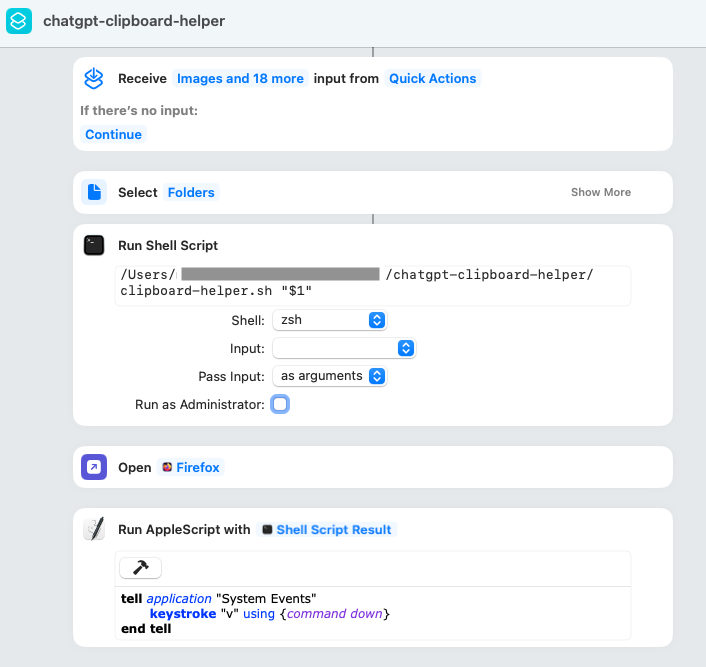

# ChaGPT clipboard helper

This script extracts Python file content from a local Git repository, copies it to the clipboard, and pastes it into a ChatGPT prompt.

It works with macOS Shortcuts to easily share local project code with ChatGPT models lacking file upload support (e.g., `o1` or `o1-mini`).

## Usage

Trigger the script via a macOS Shortcut that sets the repository path. Shortcuts requires appropriate permissions in Development tools (needed for the press of `Ctrl+V`).



## Features
- Extracts Python files from a local Git repository.
- Copies content to the clipboard in a structured format.
- Paste the content in the ChatGPT prompt (Shortcuts).

## Requirements
- macOS
- Git
- `pbcopy` (default macOS clipboard utility)

## Output Format
```
[filename.py]
<file content>
...
```

## Notes
- Input directory must be a valid Git repository.
- Only Git-tracked Python files are included.

